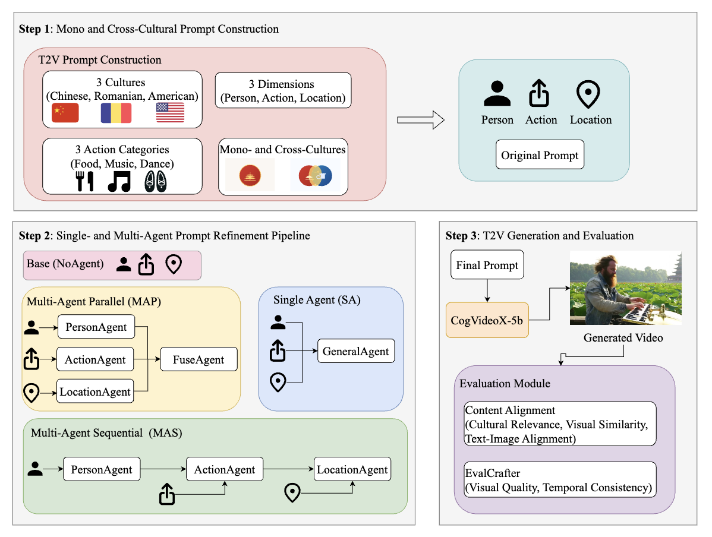

# CRAFT: A Multi-Agent Framework for Multicultural Text-to-Video Generation

Multi<strong>C</strong>ultu**R**al Multi-**A**gent **F**ramework for **T**ext-to-video Generation

## Overview

CRAFT is a multi-agent prompt refinement framework designed to improve the cultural fidelity and inclusivity of text-to-video (T2V) generation systems. With the rapid development of T2V models, there is an increasing need to accurately represent diverse cultures not only in isolation but also when multiple cultural elements are combined within a single prompt.

This repository contains the implementation and evaluation code for our research on culturally faithful text-to-video generation.

## Problem Statement

Current T2V models face two main challenges:
1. **Limited cross-cultural generation**: Existing benchmarks primarily focus on single-culture scenarios, lacking systematic study of cross-cultural (multiple cultures within one prompt) generation
2. **Cultural fidelity gaps**: T2V models often fail to accurately represent cultural details, customs, and visual elements, especially for non-western cultures

## Approach



CRAFT addresses these challenges through a three-step pipeline:

### Step 1: Mono- and Cross-Cultural Prompt Construction
- **3 Cultures**: Chinese, Romanian, American
- **3 Dimensions**: Person, Action, Location
- **3 Action Categories**: Food, Music, Dance (27 cultural actions total)
- **Two Scenarios**:
  - Mono-cultural: All dimensions from the same culture
  - Cross-cultural: Dimensions from different cultures (e.g., "a Chinese person eating hot dogs at Bran Castle")

### Step 2: Multi-Agent Prompt Refinement Pipeline

We design and compare four architectures:

- **Base (NoAgent)**: No prompt refinement (baseline)
- **Single-Agent (SA)**: One agent refines the entire prompt
- **Multi-Agent Sequential (MAS)**: Three specialized agents (PersonAgent, ActionAgent, LocationAgent) refine sequentially
- **Multi-Agent Parallel (MAP)**: Three specialized agents refine in parallel, then FuseAgent integrates the results

### Step 3: T2V Generation and Evaluation

**Generation**: CogVideoX-5B model generates videos from refined prompts

**Evaluation**:
- **Content Alignment**: Cultural Relevance, Visual Similarity, Text-Image Alignment (CLIP-based metrics)
- **Video Quality**: Visual Quality and Temporal Consistency (EvalCrafter)
- **VLM-based Judgment**: Gemini 2.5 Pro evaluates cultural fidelity

## Key Findings

1. **MAP achieves highest cultural relevance** among all refinement pipelines, with the most balanced improvement on both video quality and temporal consistency
2. **Cross-cultural prompts pose larger challenges** than mono-cultural prompts, showing ~5% lower cultural relevance
3. **Moderate to strong positive correlation** between CLIP-based metrics and VLM-based evaluation on cultural relevance

## Dataset

We construct a comprehensive dataset of **972 videos** covering:
- 3 cultures (Chinese, American, Romanian)
- 27 cultural actions across 3 categories
- 9 iconic cultural locations
- Both mono-cultural and cross-cultural scenarios

The dataset is available at https://huggingface.co/datasets/sl-scu/multicultural_multiagent_videos


## Citation

If you find this work helpful, please cite:

```bibtex
@article{craft2025,
  title={CRAFT: A Multi-Agent Framework for Multicultural Text-to-Video Generation},
  author={[Shuowei Li, Oana Ignat]},
  year={2025}
}
```

## Acknowledgments

This research contributes to building more culturally faithful and inclusive T2V generation systems, paving the way for respectful and multi-cultural video content generation in the context of globalization.
